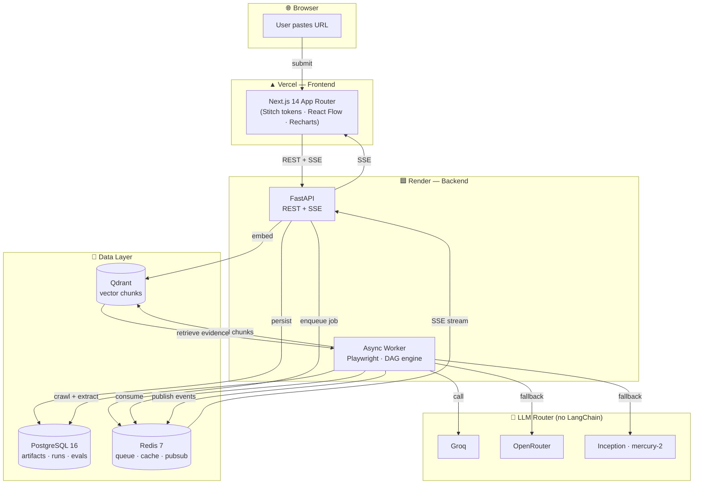
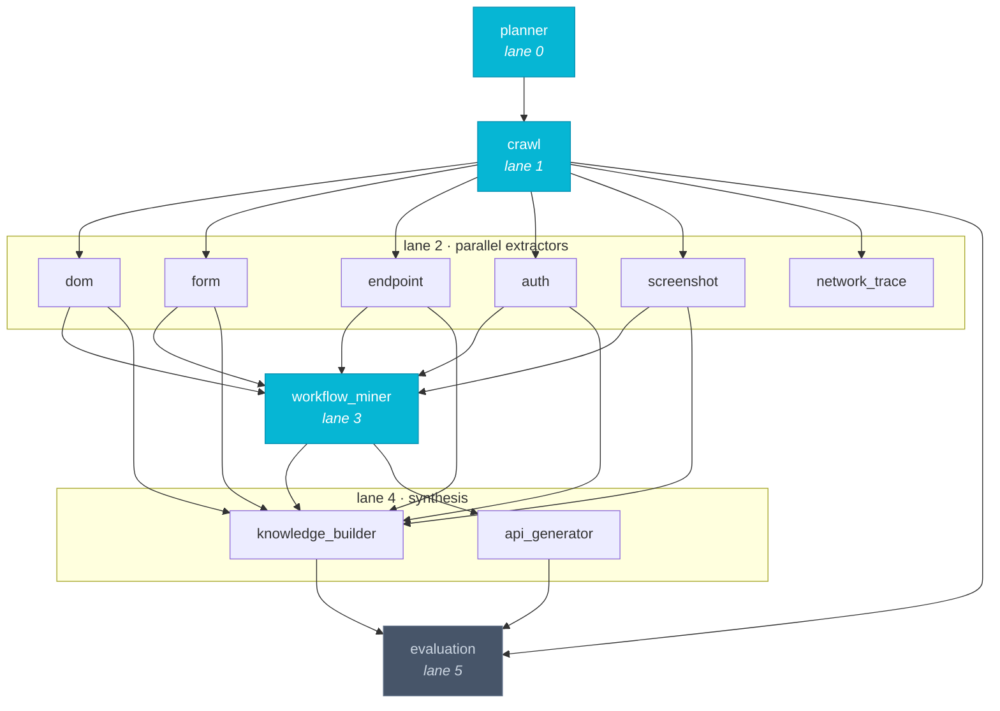
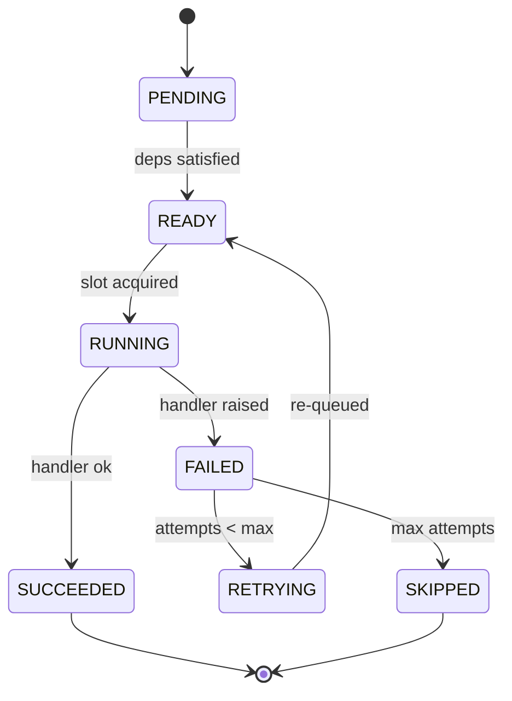
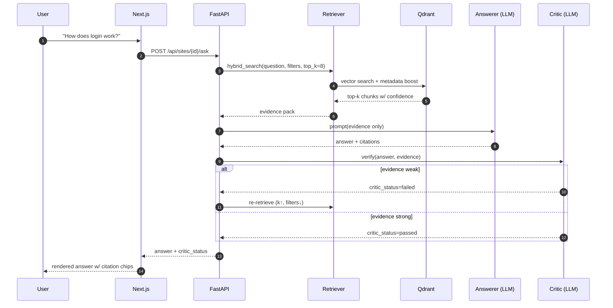

<div align="center">

# 🧠 SiteMind

**A website intelligence platform that turns any live site into a structured, queryable, inspectable knowledge system.**

*Paste a URL. Get a measurable intelligence graph: what exists, how it behaves, how it connects, and how confidently the system knows it.*

[](https://www.python.org)
[](https://fastapi.tiangolo.com)
[](https://nextjs.org)
[](https://www.typescriptlang.org)
[](https://www.postgresql.org)
[](https://qdrant.tech)
[](https://redis.io)
[](https://playwright.dev)
[](./LICENSE)

[🚀 Quick Start](#-quick-start) · [📚 Docs](./docs/README.md) · [🏗️ Architecture](#-architecture) · [🧪 API Examples](#-api-quick-examples) · [📊 Assignment Results](#-assignment-results)

</div>

---

## ✨ What is SiteMind?

**SiteMind** is **not** a chatbot. **Not** a generic scraper. **Not** a PDF QA wrapper.

It is a **production-grade single-site intelligence engine** that:

1. **🕷️ Crawls** a live site with Playwright (JS-heavy, screenshots, network traces).
2. **🧬 Extracts** structured artifacts — pages, forms, endpoints, auth signals, workflows — in **parallel**.
3. **🧠 Builds** a hybrid knowledge base (semantic + metadata) in PostgreSQL + Qdrant.
4. **💬 Answers** natural-language questions using **only retrieved evidence** (no hallucination).
5. **🛡️ Critiques** every answer and triggers re-retrieval if the evidence is weak.
6. **🔁 Infers** multi-step user workflows and synthesises **OpenAPI 3.0 specs** from them.
7. **📊 Evaluates** retrieval precision, grounding, and DAG health on a live dashboard.

All orchestrated by a **custom async DAG engine** — no LangChain, no LangGraph, just Python + `asyncio`.

> **Core promise:** every claim is **cited**, every artifact has a **confidence score**, and every failed branch is **visible** — never silently hidden.

---

## 🎬 The Dashboard

A **dark, premium, Stitch-designed** Next.js dashboard surfaces the entire pipeline:

| Screen | What it shows |
|--------|---------------|
| **Overview** | Crawl progress, endpoint method distribution, depth histogram, recent discoveries |
| **DAG View** | Live React Flow graph of the 12-node analysis DAG, with status colours, timings, and parallel lanes |
| **Knowledge Base** | Browse and search the vector chunk corpus with confidence filters |
| **Pages · Forms · Endpoints · Auth Signals** | Filterable, inspectable artifact tables with a right-rail **Artifact Inspector** |
| **Workflows** | Multi-step user journeys with click-to-inspect RAG evidence per step |
| **API Specs** | Auto-generated **OpenAPI 3.0** JSON for each inferred workflow, with `x-sitemind-inferred: true` markers |
| **Q&A** | Chat-style grounded answers with clickable citations that open the source evidence |
| **Evaluation** | Grounding score, recall@k, precision@k, MRR, critic recovery rate, DAG failure heatmap |

---

## 🏗️ Architecture



---

## 🧬 The 12-Node Analysis DAG

Every crawl runs through this explicit dependency graph. Nodes in the **same lane** execute in **parallel**; lanes are processed in order.



### State machine



### Resumability

On worker boot, the engine loads `dag_runs WHERE status='running'`, marks stale `RUNNING` nodes back to `READY`, and re-queues anything whose dependencies are `SUCCEEDED`. Artifact writes are **idempotent** via `content_hash` / `chunk_hash` upserts.

---

## 🔍 Retrieval & RAG Flow



**Hybrid score:**
```
final_score = 0.45 · semantic
            + 0.25 · metadata_match
            + 0.20 · confidence
            + 0.10 · recency_within_run
```

---

## 🧪 Code Highlights

### 1. The DAG engine — `app/dag/engine.py`

A minimal `asyncio` executor with a per-run semaphore, dependency tracking, and per-node timing.

```python
class DagEngine:
    """Minimal asyncio DAG executor with parallel fan-out and per-node timing."""

    def __init__(self, max_parallel: int = 8) -> None:
        self.max_parallel = max_parallel
        self._sem = asyncio.Semaphore(max_parallel)

    async def run(self, query, nodes, edges, context) -> DagRunResult:
        run_id = str(uuid.uuid4())
        states = {n.key: NodeState(spec=n) for n in nodes}
        deps   = {n.key: set() for n in nodes}
        rev    = {n.key: set() for n in nodes}
        for e in edges:
            deps[e.to_key].add(e.from_key)
            rev[e.from_key].add(e.to_key)

        for key, state in states.items():
            if not deps[key]:
                state.status = NodeStatus.READY

        t0 = time.perf_counter()
        async def execute_one(key: str) -> None:
            state = states[key]
            async with self._sem:
                state.status = NodeStatus.RUNNING
                t_node = time.perf_counter()
                inputs = {dep: states[dep].output
                          for dep in deps[key]
                          if states[dep].status == NodeStatus.SUCCEEDED}
                out = await state.spec.handler(
                    {**context, "inputs": inputs, "query": query, "run_id": run_id}
                )
                state.output = out
                state.duration_ms = int((time.perf_counter() - t_node) * 1000)
                state.status = NodeStatus.SUCCEEDED

        # schedule READY nodes, re-enqueue as deps finish …
        # (see app/dag/engine.py for the full scheduler)
```

### 2. The planner — `app/dag/planner.py`

DAG topology is **data**, not code — easy to inspect, version, and re-plan.

```python
def plan_site_crawl_dag(handlers):
    """Site analysis DAG: crawl -> parallel extractors -> workflow -> knowledge -> eval."""
    nodes = [
        NodeSpec("planner",          "planner",   handlers["planner"],          lane=0),
        NodeSpec("crawl",            "crawl",     handlers["crawl"],            lane=1),
        NodeSpec("dom",              "extractor", handlers["dom"],              lane=2),
        NodeSpec("form",             "extractor", handlers["form"],             lane=2),
        NodeSpec("endpoint",         "extractor", handlers["endpoint"],         lane=2),
        NodeSpec("auth",             "extractor", handlers["auth"],             lane=2),
        NodeSpec("screenshot",       "extractor", handlers["screenshot"],       lane=2),
        NodeSpec("network_trace",    "extractor", handlers["network_trace"],    lane=2),
        NodeSpec("workflow_miner",   "workflow",  handlers["workflow_miner"],   lane=3),
        NodeSpec("knowledge_builder","knowledge", handlers["knowledge_builder"],lane=4),
        NodeSpec("api_generator",    "api",       handlers["api_generator"],    lane=4),
        NodeSpec("evaluation",       "evaluation",handlers["evaluation"],       lane=5),
    ]
    edges = [
        EdgeSpec("planner", "crawl"),
        EdgeSpec("crawl",   "dom"),
        EdgeSpec("crawl",   "form"),
        # … 5-way fan-out from crawl …
        EdgeSpec("dom",     "workflow_miner"),
        EdgeSpec("form",    "workflow_miner"),
        # … workflow + knowledge + api_generator converge on evaluation …
    ]
    return nodes, edges
```

### 3. The agent orchestrator — `agent/orchestrator.py`

Classifies the query, plans the right DAG, runs it through the engine, and attaches proof-of-parallelism.

```python
async def run_query(query: str, *, evidence=None, critic_force_fail=False) -> DagRunResult:
    config = load_config()
    query_kind, base_id = _classify_query(query, config)

    handlers = build_handlers()
    nodes, edges = plan_agent_query_dag(handlers, query_kind)

    ctx = {
        "evidence": evidence or mock_evidence(),
        "query_kind": query_kind,
        "critic_force_fail": critic_force_fail,
    }
    engine = DagEngine(max_parallel=config["orchestrator"].get("max_parallel", 8))
    result = await engine.run(query, nodes, edges, ctx)

    if query_kind == "parallel_fanout":
        # attach branch_durations_ms to the merge node as proof of parallelism
        timings = {ns.spec.key: ns.duration_ms
                   for ns in result.nodes if ns.spec.key.startswith("branch_")}
        merge = next(n for n in result.nodes if n.spec.key == "merge")
        merge.output.setdefault("parallel_proof", {})["branch_durations_ms"] = \
            list(timings.values())
    return result
```

### 4. The Q&A API client — `frontend/src/lib/api-client.ts`

Strictly typed, envelope-aware, with a single `apiFetch` core that every call routes through.

```ts
export async function askQuestion(
  siteId: string,
  body: AskRequest,
): Promise<AskResponse> {
  return apiFetch<AskResponse>(`/sites/${siteId}/ask`, {
    method: "POST",
    body: JSON.stringify(body),
  });
}

export async function apiFetch<T>(path: string, init?: RequestInit): Promise<T> {
  const url = buildUrl(path);
  const response = await fetch(url, { ...init, headers: makeHeaders(init) });
  const envelope = (await response.json()) as ApiEnvelope<T>;

  if (envelope.error) {
    throw new ApiClientError(envelope.error.code, envelope.error.message,
                             response.status, envelope.error.details);
  }
  if (!response.ok)
    throw new ApiClientError("HTTP_ERROR",  `Request failed: ${response.status}`, response.status);
  if (envelope.data === null)
    throw new ApiClientError("EMPTY_DATA", "Response had no data", response.status);
  return envelope.data;
}
```

### 5. Live SSE pipeline — `frontend/src/hooks/useJobEvents.ts`

Stream DAG events straight into the React tree.

```ts
export function useJobEvents(jobId: string | null, { enabled = true, onEvent } = {}) {
  const [connected, setConnected] = useState(false);
  const [events, setEvents] = useState<JobEvent[]>([]);
  const onEventRef = useRef(onEvent);
  onEventRef.current = onEvent;

  useEffect(() => {
    if (!jobId || !enabled) return;
    const source = new EventSource(getEventsUrl(jobId));

    source.onopen  = () => setConnected(true);
    source.onerror = () => setConnected(false);
    source.onmessage = (e) => {
      const evt: JobEvent = {
        id: e.lastEventId || crypto.randomUUID(),
        type: e.type || "message",
        data: JSON.parse(e.data),
        receivedAt: Date.now(),
      };
      setEvents((prev) => [...prev, evt]);
      onEventRef.current?.(evt);
    };

    return () => source.close();
  }, [jobId, enabled]);

  return { connected, events, lastEvent: events[events.length - 1] ?? null };
}
```

---

## 🧪 API Quick Examples

Every endpoint is envelope-shaped: `{ "data": …, "error": null }`.

### 1. Submit a URL

```bash
curl -X POST http://localhost:8000/api/sites \
  -H "Content-Type: application/json" \
  -d '{
    "url": "https://books.toscrape.com",
    "goal": "Map site structure and forms",
    "crawl_depth": 3,
    "page_budget": 60,
    "include_screenshots": true,
    "include_network_traces": true
  }'
```

**Response `201`:**
```json
{
  "data": {
    "site_id":      "550e8400-e29b-41d4-a716-446655440000",
    "crawl_job_id": "660e8400-e29b-41d4-a716-446655440001",
    "dag_run_id":   "770e8400-e29b-41d4-a716-446655440002",
    "status":       "queued"
  },
  "error": null
}
```

### 2. Poll job status

```bash
curl http://localhost:8000/api/jobs/$JOB_ID | jq
```

```json
{
  "data": {
    "job_id": "660e8400-…",
    "site_id": "550e8400-…",
    "status": "running",
    "progress": {
      "pages_discovered": 24,
      "pages_processed":  18,
      "chunks_indexed":   52,
      "forms_found":      3,
      "endpoints_found":  8,
      "workflows_found":  1
    }
  }
}
```

### 3. Stream live DAG events (SSE)

```bash
curl -N http://localhost:8000/api/jobs/$JOB_ID/events
```

```
event: job.progress
data: {"job_id":"660e8400-…","pages_discovered":10,"chunks_indexed":20}

event: dag.node.completed
data: {"dag_run_id":"770e8400-…","node_key":"dom","status":"succeeded","duration_ms":1200}

event: artifact.created
data: {"site_id":"550e8400-…","artifact_type":"form","count":1}
```

### 4. Ask a grounded question

```bash
curl -X POST http://localhost:8000/api/sites/$SITE_ID/ask \
  -H "Content-Type: application/json" \
  -d '{
    "question": "How does login work?",
    "filters": { "artifact_types": ["auth", "form", "page"] },
    "top_k": 8
  }' | jq
```

```json
{
  "data": {
    "answer_id": "uuid",
    "answer": "Login is presented on /login via email and password fields…",
    "confidence": 0.82,
    "critic_status": "passed",
    "citations": [
      {
        "chunk_id":     "uuid",
        "source_url":   "https://example.com/login",
        "artifact_type":"auth",
        "snippet":      "Sign in with your email",
        "score":        0.91
      }
    ]
  }
}
```

### 5. Generate an OpenAPI spec from a workflow

```bash
curl -X POST http://localhost:8000/api/sites/$SITE_ID/generate-api \
  -H "Content-Type: application/json" \
  -d '{ "workflow_id": "'$WORKFLOW_ID'" }' | jq
```

Full reference: **[docs/api.md](./docs/api.md)**.

---

## 📁 Project Structure

```text
SiteMind/
├── app/                          # FastAPI backend
│   ├── main.py                   # API entry point
│   ├── worker.py                 # Async DAG worker
│   ├── api/                      # REST + SSE routes
│   │   ├── routes_sites.py
│   │   ├── routes_jobs.py
│   │   ├── routes_pages.py
│   │   ├── routes_forms.py
│   │   ├── routes_endpoints.py
│   │   ├── routes_workflows.py
│   │   ├── routes_qa.py
│   │   ├── routes_evaluations.py
│   │   ├── routes_api_specs.py
│   │   ├── routes_dag.py
│   │   └── routes_health.py
│   ├── core/                     # Config, DB, Redis, Qdrant, security
│   ├── crawler/                  # Playwright frontier + page fetcher
│   ├── dag/                      # 🧠 Custom DAG engine + planner
│   │   ├── engine.py
│   │   ├── planner.py
│   │   └── models.py
│   ├── services/                 # Crawl, embed, retrieve, answer, evaluate
│   ├── models/orm.py             # SQLAlchemy ORM
│   └── schemas/                  # Pydantic request/response
├── agent/                        # 🤖 Assignment DAG agent
│   ├── orchestrator.py
│   ├── handlers.py
│   ├── sandbox_executor.py
│   └── prompts/                  # planner · coder · critic · investigator · formatter
├── frontend/                     # ▲ Next.js 14 (Stitch UI)
│   ├── src/app/sites/[siteId]/   # Overview · DAG · Pages · Forms · …
│   ├── src/components/           # Cards · badges · status chips · layout
│   ├── src/context/              # ArtifactContext
│   ├── src/hooks/useJobEvents.ts # Live SSE
│   ├── src/lib/api-client.ts     # Typed fetch + envelope
│   └── src/styles/stitch-tokens.css
├── alembic/                      # DB migrations
├── docs/                         # 📚 Product · architecture · API · data-model
├── scripts/                      # Benchmarks & utility scripts
├── logs/assignment/              # 📊 Assignment benchmark results
├── docker-compose.yml            # Postgres · Redis · Qdrant
├── pyproject.toml                # uv-managed Python project
└── README.md                     # 👈 you are here
```

---

## 🛠️ Tech Stack

| Layer | Tech |
|-------|------|
| **API** | FastAPI · Uvicorn · Pydantic v2 |
| **Async runtime** | Python 3.12 · `asyncio` · `httpx` |
| **DAG engine** | Custom (`app/dag/engine.py`) — no LangGraph |
| **Browser** | Playwright (Chromium) — JS render, screenshots, network |
| **Datastore** | PostgreSQL 16 + Alembic · Redis 7 (queue, cache, pubsub) |
| **Vector store** | Qdrant 1.x · `fastembed` (`BAAI/bge-small-en-v1.5`, 384-d) |
| **LLM router** | Groq → OpenRouter → Inception (mercury-2) — graceful fallback |
| **Frontend** | Next.js 14 App Router · TypeScript 5 · Tailwind · shadcn/ui |
| **Diagrams** | React Flow (`@xyflow/react`) · Recharts |
| **Streaming** | Server-Sent Events (SSE) |
| **Design tokens** | Google Stitch project `17227002468425644233` |
| **Package mgmt** | `uv` (Python) · `npm` (Node) |
| **Deploy** | Vercel (FE) · Render (API + worker + DBs) · Qdrant Cloud |

---

## 🚀 Quick Start

### 0. Prerequisites

- **Python 3.12+** with [`uv`](https://docs.astral.sh/uv/)
- **Node.js 20+** with `npm`
- **Docker** + Docker Compose
- At least **one** LLM API key: Groq (preferred), OpenRouter, or Inception

### 1. Clone & configure

```bash
git clone https://github.com/SairajMN/SiteMind.git
cd SiteMind

cp .env.example .env
cp frontend/.env.example frontend/.env.local
```

Edit `.env` and fill in your keys:

```bash
GROQ_API_KEY=gsk_…
OPENROUTER_API_KEY=sk-or-…
INCEPTION_API_KEY=…
QDRANT_API_KEY=…                # only if using Qdrant Cloud
```

For local crawl testing, also set:

```bash
ALLOW_LOCALHOST_TARGETS=true
```

### 2. Start infrastructure

```bash
docker compose up -d            # Postgres · Redis · Qdrant
```

### 3. Migrate the database

```bash
uv run alembic upgrade head
```

### 4. Run the API

```bash
uv run sitemind-api             # http://localhost:8000
```

Smoke-test:

```bash
curl http://localhost:8000/api/health
# → { "status": "ok", "postgres": "ok", "redis": "ok", "qdrant": "ok" }
```

### 5. Run the worker (in a second terminal)

```bash
uv run python -m app.worker
```

### 6. Run the frontend

```bash
cd frontend
npm install
npm run dev                     # http://localhost:3000
```

Open <http://localhost:3000> and try the example below.

---

## 🧪 Example: Crawling a Website

### 7a. Using the Dashboard (UI)

1. Open <http://localhost:3000>
2. Paste a crawler-friendly URL into the input box, e.g.:
   - `https://quotes.toscrape.com`
   - `https://books.toscrape.com`
   - `https://httpbin.org`
3. Adjust **Crawl & Analyzer Settings** (max depth, same domain, etc.)
4. Click **"Analyze website"**
5. Watch the **12-node DAG** light up in real time
6. Browse results in the sidebar: Overview → DAG → Knowledge Base → Auth Signals → Workflows → API Specs → Q&A → Evaluation

### 7b. Using the API (curl)

**Step 1 — Submit a site for analysis:**

```bash
curl -X POST http://localhost:8000/api/sites   -H "Content-Type: application/json"   -d '{"url": "https://quotes.toscrape.com", "goal": "Analyze website structure and workflows"}'
```

Response:

```json
{
  "data": {
    "site_id": "c0d2e7ac-...",
    "crawl_job_id": "7585fc07-...",
    "dag_run_id": "2d28994b-...",
    "status": "queued"
  }
}
```

**Step 2 — Check crawl status** (wait ~30 seconds):

```bash
curl http://localhost:8000/api/sites/<site_id>
```

Look for `"latest_job_status": "completed"`.

**Step 3 — View extracted pages:**

```bash
curl http://localhost:8000/api/sites/<site_id>/pages
```

Example result (60 pages from `quotes.toscrape.com`):

| Path | Status | Auth Hint |
|------|--------|-----------|
| `/` | 200 | ✅ |
| `/login` | 200 | ✅ |
| `/page/2/` | 200 | ✅ |
| `/author/Albert-Einstein` | 200 | ✅ |
| `/tag/love/page/1/` | 200 | ✅ |

**Step 4 — View endpoints:**

```bash
curl http://localhost:8000/api/sites/<site_id>/endpoints
```

**Step 5 — View in the dashboard:**

Open <http://localhost:3000/sites/<site_id>> to explore all artifacts visually.

### 7c. Sites That Work Well

| Site | URL | Why |
|------|-----|-----|
| Quotes to Scrape | `https://quotes.toscrape.com` | Built for testing crawlers |
| Books to Scrape | `https://books.toscrape.com` | Forms, pagination, search |
| HTTPBin | `https://httpbin.org` | API endpoints, forms |
| Playwright Demo | `https://demo.playwright.dev` | Rich interactive UI |


---

## 🔐 Environment Variables

| Var | Default | Purpose |
|-----|---------|---------|
| `LLM_PRIMARY` | `groq` | First-choice LLM provider |
| `GROQ_API_KEY` | — | Groq API key (preferred) |
| `GROQ_MODEL` | `llama-3.3-70b-versatile` | Groq model id |
| `OPENROUTER_API_KEY` | — | OpenRouter fallback |
| `OPENROUTER_MODEL` | `google/gemma-2-9b-it:free` | OpenRouter model |
| `INCEPTION_API_KEY` | — | Inception mercury-2 fallback (structured JSON) |
| `INCEPTION_MODEL` | `mercury-2` | Inception model |
| `EMBEDDING_PROVIDER` | `fastembed` | Local embedding provider |
| `EMBEDDING_MODEL` | `BAAI/bge-small-en-v1.5` | Embedding model |
| `EMBEDDING_DIM` | `384` | Vector size (must match Qdrant collection) |
| `QDRANT_URL` | `http://localhost:6333` | Qdrant endpoint |
| `QDRANT_API_KEY` | — | Qdrant Cloud key (if used) |
| `REDIS_URL` | `redis://localhost:6379/0` | Redis endpoint |
| `DATABASE_URL` | `postgresql+asyncpg://…` | Postgres connection string |
| `CRAWL_MAX_DEPTH` | `5` | Max crawl depth |
| `CRAWL_MAX_PAGE_BUDGET` | `200` | Max pages per crawl |
| `ALLOW_LOCALHOST_TARGETS` | `false` | Allow SSRF to local targets (dev only) |
| `RATE_LIMIT_CREATE_SITE` | `5/min/IP` | Rate limit for `POST /api/sites` |
| `RATE_LIMIT_ASK` | `10/min/IP` | Rate limit for `POST /api/sites/{id}/ask` |
| `RATE_LIMIT_DEFAULT` | `60/min/IP` | Default rate limit |

---

## 📊 Assignment Results

The repo includes a self-contained **DAG-agent benchmark** that exercises the orchestrator + engine end-to-end. Run it locally:

```bash
uv run sitemind-benchmark
```

Live results: [`logs/assignment/SUMMARY.json`](./logs/assignment/SUMMARY.json) — `all_passed: true` when the system is healthy.

| Part | Requirement | Evidence |
|------|-------------|----------|
| 1 | Base queries `hello`, `A`, `I`, `J`, `K` | `logs/assignment/1_base_*.log` |
| 2 | Parallel fan-out (3 branches, max ≈ wall-clock) | `logs/assignment/2_parallel_fanout.log` |
| 3 | Critic pass + fail + Planner recovery | `logs/assignment/3_critic_*.log` |
| 4 | Coder + SandboxExecutor | `logs/assignment/4_coder_sandbox.log`, `agent/prompts/coder.md` |
| 5 | New skill — Investigator | `logs/assignment/5_investigator_skill.log`, `agent/prompts/investigator.md` |

See **[docs/ASSIGNMENT.md](./docs/ASSIGNMENT.md)** for the full breakdown of each part, the prompts, and the recovery semantics.

---

## 📚 Documentation

| Doc | What you'll find |
|-----|------------------|
| [docs/README.md](./docs/README.md) | Documentation index |
| [docs/product.md](./docs/product.md) | Personas, scope, UX, KPIs, risks, delivery phases |
| [docs/architecture.md](./docs/architecture.md) | System, DAG engine, retrieval, LLM router, deployment |
| [docs/api.md](./docs/api.md) | Complete REST + SSE contract with request/response samples |
| [docs/data-model.md](./docs/data-model.md) | PostgreSQL tables · Qdrant collections · ER diagram |
| [docs/GETTING_STARTED.md](./docs/GETTING_STARTED.md) | Step-by-step local setup |
| [docs/ASSIGNMENT.md](./docs/ASSIGNMENT.md) | DAG agent assignment writeup |
| [docs/design/stitch.md](./docs/design/stitch.md) | **Frontend source of truth** — [Google Stitch project](https://stitch.withgoogle.com/projects/17227002468425644233) |

---

## 🤝 Contributing

1. Fork & branch from `main`.
2. `uv sync` to install Python deps.
3. `cd frontend && npm install` for the dashboard.
4. Make your change; keep PRs focused.
5. Run the benchmark before pushing: `uv run sitemind-benchmark`.
6. Open a PR with a short demo GIF / screenshot for UI changes.

> Code of conduct: be kind, be precise, cite your evidence. 🛡️

---

## 📜 License

Released under the [MIT License](./LICENSE).

---

<div align="center">

Built with 🧠 + ☕ for the SiteMind hackathon.
*Every claim cited. Every artifact scored. Every failure visible.*

</div>
