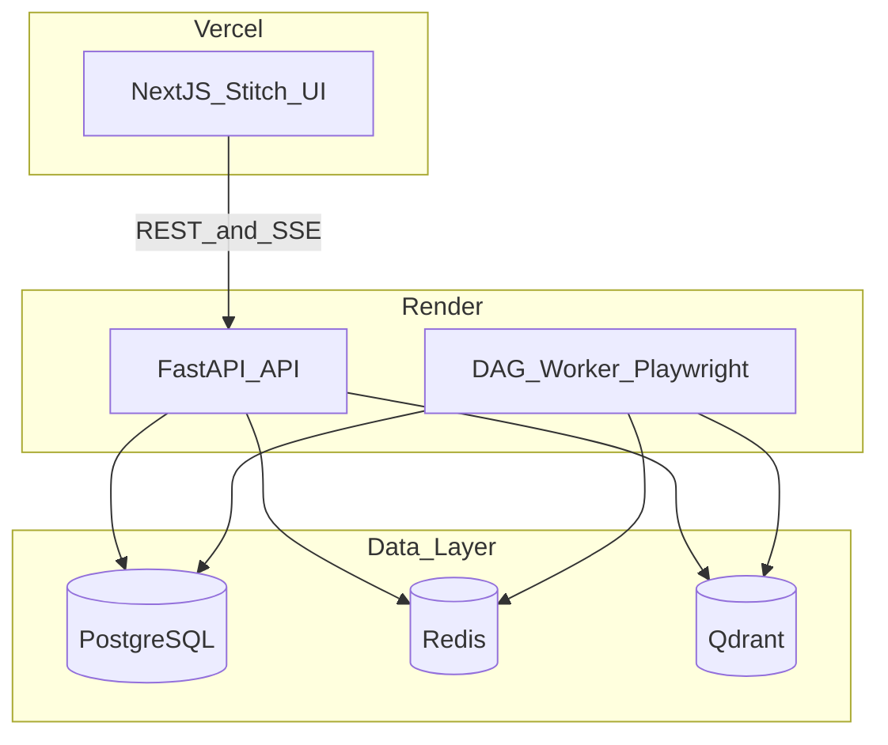
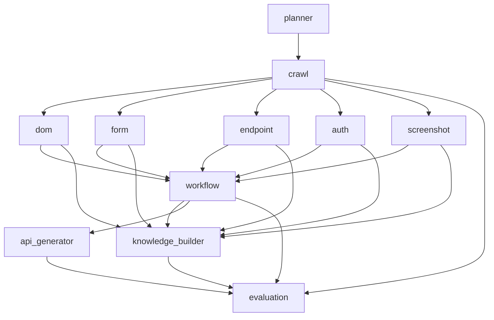

# SiteMind — System Architecture (MVP)

## High-level architecture



**Confidence: 89** — Split API/worker is required for Playwright on Render.

---

## Frontend architecture (Stitch-first)

| Layer | Responsibility |
|-------|----------------|
| **Stitch project** `17227002468425644233` | Visual design, layout, tokens |
| **Next.js `frontend/`** | Routes, data fetching, SSE, React Flow, Recharts |
| **shadcn/ui** | Interactive primitives mapped from Stitch blocks |

Export workflow: [design/stitch.md](./design/stitch.md).

**Confidence: 86** — Implementation quality depends on Stitch export fidelity.

---

## Backend services

| Service | Responsibility |
|---------|----------------|
| **Ingestion** | URL validation, scope, enqueue job |
| **Crawl orchestration** | Frontier, dedupe, robots, page budget |
| **DAG execution** | Schedule nodes, retries, telemetry |
| **Retrieval** | Hybrid search, rerank, evidence pack |
| **Answer** | Evidence-only prompts, citations |
| **Critic** | Support check, re-retrieve trigger |
| **Evaluation** | Per-run metrics aggregation |
| **API generation** | Workflow → OpenAPI-like JSON |

---

## Execution flow

1. `POST /api/sites` creates `sites`, `crawl_jobs`, `dag_runs` (`queued`).
2. Worker dequeues from Redis; **Planner** writes `dag_nodes` + `dag_edges`.
3. **Crawl** discovers pages → fan-out: DOM, Form, Endpoint, Auth, Screenshot (parallel).
4. **Workflow miner** after extractors; **Knowledge builder** chunks + embeds; **API generator** after workflows.
5. **Evaluation** aggregates when branches terminal (success or failed).
6. Q&A on demand: Retriever → Answer → Critic (not blocking site DAG).
7. SSE publishes `job.*`, `dag.node.*`, `artifact.*` events.

**Confidence: 90** — Matches PRD dependency graph.

---

## Repository layout

```text
app/
  main.py
  worker.py
  api/routes_*.py
  core/{config,logging,security,database,redis,qdrant}.py
  llm/{client,router,prompts}.py
  dag/{engine,planner,scheduler,models,telemetry}.py
  crawler/{browser,frontier,robots,page_fetcher,dedupe}.py
  extractors/{dom,forms,endpoints,auth,screenshots,workflows}.py
  retriever/{chunker,embeddings,hybrid,reranker,citations}.py
  rag/{answerer,grounding}.py
  critic/{critic,recovery}.py
  evaluation/{metrics,scoring}.py
  workflows/{miner,api_generator}.py
  models/orm.py
  schemas/*.py
  services/*.py
frontend/                    # from Stitch export + integration
  styles/stitch-tokens.css
  app/
  components/
  lib/api-client.ts
  hooks/useJobEvents.ts
docs/
eval/golden/
```

---

## Custom DAG engine

### Core types

- `NodeSpec`, `EdgeSpec`, `DagRun`, `NodeState`, `ExecutionContext`, `NodeResult`

### State machine

`PENDING → READY → RUNNING → SUCCEEDED | FAILED | SKIPPED | RETRYING`

### Features

- Explicit dependency graph
- `asyncio` task execution with semaphores: `crawl=1`, `extractors=8`, `embed=4`
- Retries: max 2 for transient errors (network, timeout)
- Serializable `output_json`; input/output content hashes for idempotency

### Resumability

On worker start: load `dag_runs` where `status=running`; mark incomplete `RUNNING` nodes `READY` if stale; re-queue ready nodes whose dependencies are `SUCCEEDED`. Artifact writes use `content_hash` / `chunk_hash` upserts.

### Required nodes

| Node key | Depends on |
|----------|------------|
| planner | — (runs first in worker) |
| crawl | planner |
| dom, form, endpoint, auth, screenshot | crawl |
| workflow_miner | dom, form, endpoint, auth, screenshot |
| knowledge_builder | all extractors + workflow_miner |
| api_generator | workflow_miner |
| evaluation | crawl, extractors, workflow_miner, knowledge_builder, api_generator |

### Q&A subgraph (on demand)

`retriever → answer_generator → critic` triggered by `POST /api/sites/{id}/ask`.

### Node output contract

```json
{
  "node_id": "uuid",
  "status": "succeeded",
  "started_at": "2026-06-02T12:00:00Z",
  "ended_at": "2026-06-02T12:00:02Z",
  "duration_ms": 2000,
  "artifacts_created": 15,
  "warnings": [],
  "errors": [],
  "payload": {}
}
```

### Failure behavior

- One failed branch does not block others
- Missing network traces → low-confidence endpoints, not run failure
- Empty workflow set is valid



**Confidence: 88** — Custom engine avoids LangGraph constraint; planner_version pinned on `dag_runs`.

---

## LLM layer (no LangChain)

Use `httpx.AsyncClient` only. Router: `app/llm/router.py`.

| Priority | Provider | Typical tasks |
|----------|----------|----------------|
| 1 | **Groq** | Grounded answer, critic JSON |
| 2 | **OpenRouter** | Screenshot summary, workflow naming, answer fallback |
| 3 | **Inception Lab** | mercury-2 for structured API spec JSON |

### Environment variables

```bash
LLM_PRIMARY=groq
GROQ_API_KEY=
GROQ_MODEL=llama-3.3-70b-versatile
OPENROUTER_API_KEY=
OPENROUTER_MODEL=google/gemma-2-9b-it:free
INCEPTION_API_KEY=
INCEPTION_MODEL=mercury-2
EMBEDDING_PROVIDER=fastembed
EMBEDDING_MODEL=BAAI/bge-small-en-v1.5
EMBEDDING_DIM=384
```

### Degradation

On 429/5xx: try next provider; set `llm_degraded` warning; skip optional screenshot LLM; shorten max tokens.

**Confidence: 82** — Free tiers rate-limit; degradation is mandatory for demo reliability.

---

## Retrieval architecture

### Qdrant collections

`page_chunks`, `form_chunks`, `endpoint_chunks`, `workflow_chunks`, `screenshot_summary_chunks`, `auth_chunks`

Vector size = `EMBEDDING_DIM` (fixed per deploy).

### Payload fields

`site_id`, `page_id`, `artifact_type`, `source_url`, `title`, `chunk_text`, `confidence`, `timestamp`, `tags`

### Hybrid score

`final_score = 0.45 * semantic + 0.25 * metadata_match + 0.20 * confidence + 0.10 * recency_within_run`

Optional keyword leg: PostgreSQL `tsvector` on `retrieval_chunks.chunk_text`.

### Quality controls

- Minimum evidence threshold (default 0.35 composite)
- Max 3 chunks per page in top-k
- Artifact-type balancing when filters allow
- Critic re-retrieval: increase k, relax filters once

### Answer grounding rules

1. Use only evidence pack text in the prompt
2. Cite each material claim (`chunk_id`, `source_url`, `artifact_type`)
3. Refuse if below threshold
4. Return `confidence` and `critic_status`

**Confidence: 86** — Hybrid without cross-encoder is acceptable for MVP with diversity caps.

---

## Workflow intelligence

- **Input:** forms, link paths, endpoint sequences from network traces
- **Output:** `workflows` + `workflow_steps` (`navigate` | `click` | `submit` | `api_call`)
- **API generation:** OpenAPI 3.0 JSON; all inferred fields flagged; `warnings_json` for speculative paths

**Confidence: 80** — Heuristic mining; evaluation uses proxy vs golden steps.

---

## Observability

- Structured JSON logs: `request_id`, `job_id`, `dag_run_id`, `node_key`
- Node duration in `dag_nodes.duration_ms`
- Redis queue depth metric
- Health: `GET /health` (API); worker heartbeat key `worker:alive`

---

## Deployment

| Component | Platform |
|-----------|----------|
| Frontend | Vercel |
| API | Render Web Service |
| Worker | Render Background Worker (Docker + Playwright) |
| PostgreSQL | Render PostgreSQL |
| Redis | Render Redis |
| Qdrant | Qdrant Cloud recommended |

### Docker

- `Dockerfile.api` — slim Python image
- `Dockerfile.worker` — `mcr.microsoft.com/playwright/python` base

### Local

`docker-compose.yml`: postgres, redis, qdrant, api, worker.

**Confidence: 86** — Playwright requires worker container on Render.
