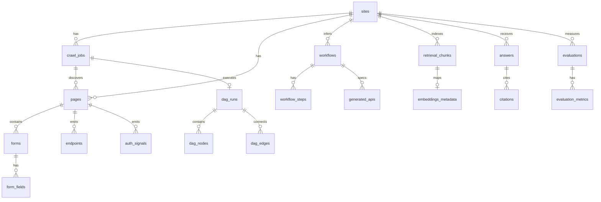

# SiteMind — Data Model (MVP)

PostgreSQL for durable structured data; Qdrant for vectors. All timestamps UTC. All `confidence` values in `[0, 1]`.

**Confidence: 93** — Schema covers every PRD artifact and API surface.

---

## Entity relationship (core)



---

## PostgreSQL tables

### `sites`

| Column | Type | Notes |
|--------|------|-------|
| id | UUID PK | |
| root_url | TEXT NOT NULL | |
| domain | TEXT NOT NULL | |
| scope_policy | TEXT NOT NULL | `same_domain` default |
| created_at | TIMESTAMPTZ | |
| updated_at | TIMESTAMPTZ | |

---

### `crawl_jobs`

| Column | Type | Notes |
|--------|------|-------|
| id | UUID PK | |
| site_id | UUID FK → sites | |
| status | TEXT | queued, running, completed, failed, blocked |
| goal | TEXT | |
| requested_depth | INT | |
| page_budget | INT | default 60 |
| started_at | TIMESTAMPTZ | |
| finished_at | TIMESTAMPTZ | |
| error_summary | TEXT | |
| created_at | TIMESTAMPTZ | |
| updated_at | TIMESTAMPTZ | |

**Index:** `(site_id, status)`

---

### `pages`

| Column | Type | Notes |
|--------|------|-------|
| id | UUID PK | |
| site_id | UUID FK | |
| crawl_job_id | UUID FK | |
| url | TEXT | canonicalized |
| canonical_url | TEXT | |
| title | TEXT | |
| depth | INT | |
| path | TEXT | |
| status_code | INT | |
| content_hash | TEXT | dedupe |
| has_form | BOOLEAN | |
| has_auth_hint | BOOLEAN | |
| created_at | TIMESTAMPTZ | |
| updated_at | TIMESTAMPTZ | |

**Unique:** `(crawl_job_id, url)`  
**Index:** `(site_id, crawl_job_id)`

---

### `page_assets`

| Column | Type | Notes |
|--------|------|-------|
| id | UUID PK | |
| page_id | UUID FK | |
| asset_type | TEXT | screenshot, dom_snapshot |
| asset_url | TEXT | |
| local_path | TEXT | |
| metadata_json | JSONB | |
| created_at | TIMESTAMPTZ | |

---

### `forms` / `form_fields`

**forms:** id, page_id, form_index, action_url, method, form_name, confidence, created_at

**form_fields:** id, form_id, name, label, field_type, required, placeholder, validation_hint, created_at

---

### `endpoints`

| Column | Type | Notes |
|--------|------|-------|
| id | UUID PK | |
| page_id | UUID FK | |
| request_url | TEXT | |
| method | TEXT | |
| request_type | TEXT | xhr, fetch, graphql |
| status_code | INT | |
| headers_json | JSONB | |
| payload_schema_json | JSONB | inferred |
| observation_type | TEXT | observed, inferred |
| confidence | FLOAT | |
| created_at | TIMESTAMPTZ | |

---

### `auth_signals`

id, page_id, signal_type, signal_value, confidence, created_at

Types: `login_form`, `oauth_button`, `session_cookie`, `bearer_hint`, `logout_link`

---

### `workflows` / `workflow_steps`

**workflows:** id, site_id, name, summary, confidence, created_at

**workflow_steps:** id, workflow_id, step_index, page_id, action_type, selector, endpoint_id, description, confidence, created_at

---

### `retrieval_chunks`

| Column | Type | Notes |
|--------|------|-------|
| id | UUID PK | |
| site_id | UUID FK | |
| page_id | UUID FK nullable | |
| artifact_type | TEXT | page, form, endpoint, auth, workflow, screenshot |
| chunk_text | TEXT | |
| chunk_hash | TEXT | |
| confidence | FLOAT | |
| source_url | TEXT | |
| title | TEXT | |
| tags_json | JSONB | |
| created_at | TIMESTAMPTZ | |

**Unique:** `(site_id, chunk_hash)`  
**Index:** `(site_id, artifact_type)`  
**Optional:** GIN on `to_tsvector('english', chunk_text)` for keyword leg

---

### `embeddings_metadata`

id, chunk_id FK, collection_name, vector_id, embedding_model, embedding_dim, created_at

---

### `answers` / `citations` / `critic_events`

**answers:** id, site_id, question, answer_text, confidence, critic_status, created_at

**citations:** id, answer_id, chunk_id, page_id, source_url, artifact_type, snippet, score, created_at

**critic_events:** id, answer_id, status, reason, recovery_action, created_at

**Index:** `citations(answer_id)`

---

### `dag_runs` / `dag_nodes` / `dag_edges`

**dag_runs:** id, site_id, crawl_job_id, status, planner_version, started_at, finished_at, created_at

**dag_nodes:** id, dag_run_id, node_key, node_type, status, attempt_count, lane, started_at, finished_at, duration_ms, error_json, output_json, created_at

**dag_edges:** id, dag_run_id, from_node_id, to_node_id, edge_type, created_at

**Index:** `dag_nodes(dag_run_id, status)`

---

### `evaluations` / `evaluation_metrics`

**evaluations:** id, site_id, crawl_job_id, dag_run_id, created_at

**evaluation_metrics:** id, evaluation_id, metric_name, metric_value, metric_unit, artifact_type, created_at

---

### `generated_apis`

id, site_id, workflow_id, spec_json JSONB, warnings_json JSONB, created_at

---

## Data integrity rules

1. `site_id` required on all site-scoped artifacts
2. `page_id` nullable only for site-level chunks
3. `chunk_hash` deduplicates retrievable text per site
4. `confidence` clamped to [0, 1] at write time
5. `source_url` stored canonicalized (no fragments; lowercase host)
6. Single active `crawl_job` per `site_id` with status `queued` or `running` (enforced in service layer)

---

## Qdrant collections

| Collection | Source artifact |
|------------|-----------------|
| page_chunks | page DOM/text |
| form_chunks | forms + fields |
| endpoint_chunks | network traces |
| workflow_chunks | step sequences |
| screenshot_summary_chunks | vision/LLM summaries |
| auth_chunks | auth signals |

### Payload schema (all collections)

```json
{
  "site_id": "uuid",
  "page_id": "uuid",
  "artifact_type": "form",
  "source_url": "https://example.com/login",
  "title": "Login form",
  "chunk_text": "Email, Password, Sign in",
  "confidence": 0.9,
  "timestamp": "2026-06-02T12:00:00Z",
  "tags": ["login"]
}
```

Point ID: use `chunk_id` (UUID string) for idempotent upsert.

### Collection config

- Distance: Cosine
- `vector_size`: from `EMBEDDING_DIM` (default 384)
- On model change: recreate collections (document in deploy runbook)

---

## Redis keys (job state)

| Key pattern | Purpose |
|-------------|---------|
| `queue:crawl_jobs` | List of job IDs |
| `job:{id}:status` | Hash: status, progress JSON |
| `job:{id}:events` | Stream for SSE replay |
| `dag_run:{id}:lock` | Worker lease |
| `worker:alive` | Heartbeat TTL |

---

## Migration strategy

- Alembic from Phase 1
- Initial revision: all tables above
- Seed script optional for local demo only

**Confidence: 92** — Redis keys are additive to PRD; standard for SSE replay.
